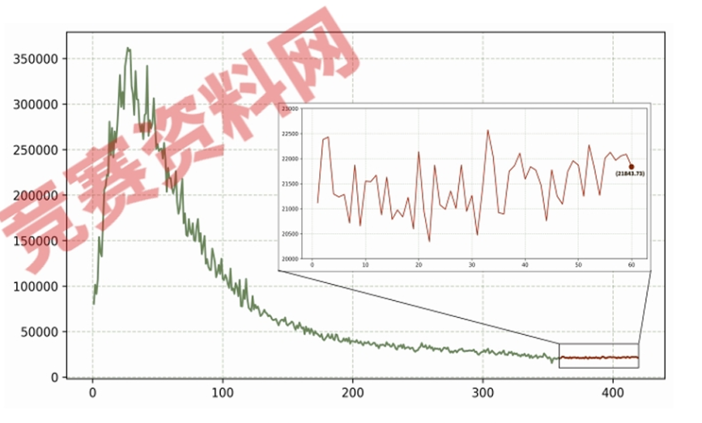
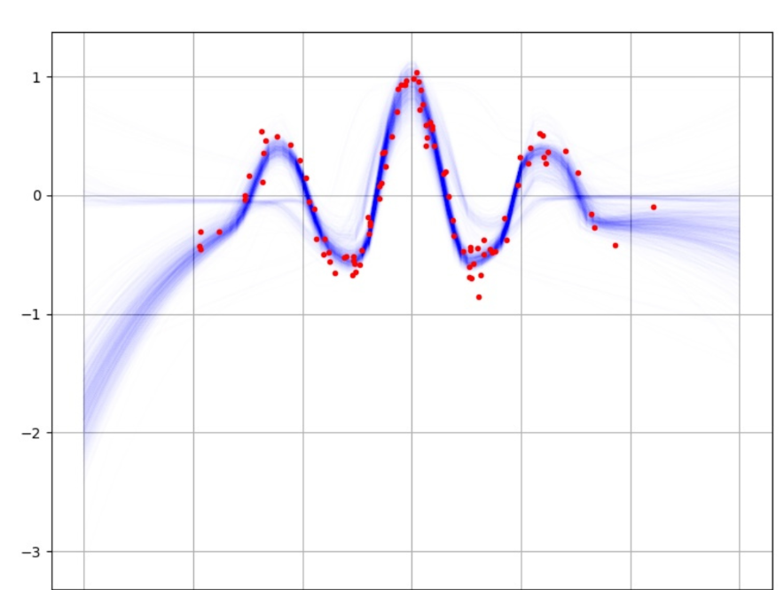
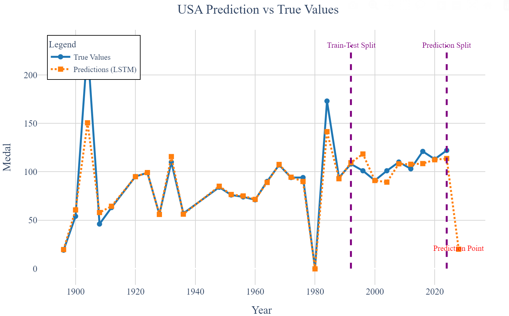

# 文件说明

这是孙海洋的文件存放处。

## 数据预处理记录

1. 四个文件中，只有 `summerlyOly_programs.csv` 中有缺失值，使用 0 填充。 

## 画图

#### 要画的图

1. Loss 图：



2. 蓝点 DropOut 图：



3. 折线图：



#### 工具

1. [Draw.io](https://app.diagrams.net/)
1. Plotly
1. [excalidraw](https://excalidraw.com/)
1. 常用 Prompt：
```
Help me modify the images generated by the following code:

1. **The generated images must look very professional.**
2. **The generated images must look very professional.**
3. **The generated images must look very professional.**
4. You can change the color scheme, borders, shapes of the points, etc. It is best to have a unified color palette, which you can find on this website: https://coolors.co/palettes/trending.
5. The font must be Times New Roman.
6. Floating elements like legends should not obstruct the chart.
7. The title should be centered, and the text should not be too tightly spaced.
8. The height and width of the chart should be appropriate.
9. Better to use library plotly.

# 设置图形风格  
sns.set(style="whitegrid")  

# 创建水平条形图  
plt.figure(figsize=(10, 6))  
colors = sns.color_palette("coolwarm", len(df))  # 使用渐变色  
sns.barplot(  
    x='Medal',   
    y='NOC',   
    data=df,   
    palette=colors  
)  

# 添加标题和标签  
plt.title('Medal Count by NOC', fontsize=16, fontweight='bold')  
plt.xlabel('Medal Count', fontsize=12)  
plt.ylabel('NOC', fontsize=12)  

# 显示图形  
plt.tight_layout()  
plt.show()
```

## 模型必要的输入、输出维度说明

输入：
1. 时间
1. 国家
1. 强势点
    1. 时间
    1. 国家
    1. 以往的数据
1. HHI
1. 得奖率
1. 东道主
1. 参赛人数
1. 历史表现

## 文献引用

1. Dropout as a Bayesian Approximation: Representing Model Uncertainty in Deep Learning

基于 Dropout 的 Monte Carlo (MC) 采样是一种简单有效的贝叶斯深度学习方法，用于量化模型预测的不确定性。它通过在测试阶段启用 Dropout，并对同一输入进行多次前向传播，生成预测分布，从而估计模型的不确定性。

说白了，引入这玩意的原因就是为了能够让**预测结果以一个区间的形式呈现**。